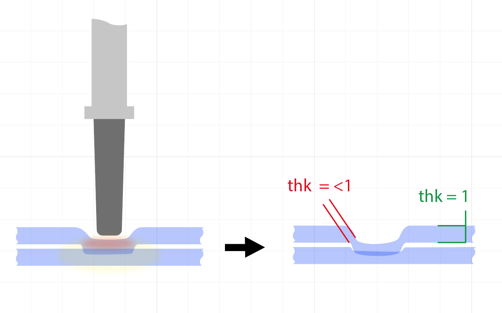

# Open design manual for fusing plastic sheets to create inflatables

## Introduction

This manual is intended to share all knowledge gathered while researching ways on how to heat-weld and fuse plastic sheets to create inflatable objects.

It is seperated into three main chapters: **Sheet material, Tools, and Technique.**

---

## Sheet material

### Types

In order to fuse thin plastic sheet material, a thermosoftening polymer material has to be used (i.e. plastic that transitions into a liquid state when heated and hardens again after cooling). Such types of plastics, that are commonly available as thin sheet material, are for example: **Polyethylene (PE), Polypropylene (PP), Polyvinyl chloride (PVC).** 

*→ Although PVC is not recommended due to [health concerns](https://en.wikipedia.org/wiki/Polyvinyl_chloride#Health_and_safety) (https://en.wikipedia.org/wiki/Polyvinyl_chloride#Health_and_safety)*

**PE is most widely available** and comes in different variants, where low-density polyethylene, or **LDPE**, is generally used for sheets.

**TPE** is another potential and interesting material, which should be more elastic as the previously stated. 
(But the author has not tested or worked with TPE as of writing this manual.)

### Thickness

Thickness is crucial for sufficient strength when inflated and is often stated in micro millimeters (abbreviated μm, or my)

*→ The thicker the sheet, the stronger the seam, but the longer the welding time.*

**Between 0,1 mm (100 my) to 0,2 mm (200 my) is a good starting point.**

### Packaging

Sheet materials comes in different packaged form and formats. Sheet material on a **role is very recommended** as it can be unrolled evenly, and without creases. **The best option is a hose**, as it already has two layers of sheets tightly on top of each other when unrolled. 

*→ Folded sheet material can be tricky to get evenly flat.*

### Recycling

Recycling is possible with most of the thermoplastic materials, and **material out of already recycled plastic is available.** 

Here a notable distinction is made:

- **PIR** (post-industrial recycling) = material consists of more homogenous waste and is of higher quality
- **PCR** (post-consumer recycling) = material consists of more heterogenic waste and is of lower quality

*→ Recycling material may feature small plastic inclusions, that can be detrimental to the tightness of the seam, where PIR material will generally feature less or none.*

---

## Tools

### Options

In order to create the seam, different tools can be used, but they all have some sort of heating element in common. 
The most suitable tools are: 

- Soldering iron with a flat round tip
- 3D-printer nozzle
- Flatiron (with pointy tip)

**The seam can be done by hand or controlled by a robot,** where the latter is to be strongly recommended (reasons are mentioned further down).

*→ Health and safety: the various types of thermoplastic all melt at temperatures around 120° C or above. When heated too extensively hazardous fumes are created. A good ventilated room or a respirator mask is strongly recommended.*

### Heat-transfer layer

**A separating heat-transfer layer is always needed,** otherwise, the plastic sheet will stick to the heating element and will eventually burn. For that purpose, a **PTFE (Teflon) coated sheet** is applicable. These are available in various thicknesses and qualities. Regular bakery paper is feasible, where a **reusable glass-fiber fabric** is recommended and more durable. 

*→ The thicker the separation layer, the longer the welding time.*

**A thickness of around 0,08 mm (80 my) is a good starting point.**

### Soldering iron

**A soldering iron is the recommended option.** It offers good **usability**, a high **temperature range,** and stability in keeping the **exact temperature.** Nearly all soldering irons offer the possibility to **exchange tips.** 

The following chapters will go into detail for two suitable tip designs.

### Temperature

The temperature of the heating element is depending on four major factors:

- Thickness of the heat-transfer layer 
- Thickness of the plastic sheet material
- Movement speed (feed rate)
- Contact pressure

Generally speaking a **temperature above the melting temperature** of the plastic material is to be set.

*→ Health and safety advice if a PTFE coated heat-transfer layer is used: PTFE is safely rated up to 260° C, and melts at around 300° C. If melted, PTFE releases hazardous fumes that can cause [acute lung injury](https://en.wikipedia.org/wiki/Polymer_fume_fever) (https://en.wikipedia.org/wiki/Polymer_fume_fever).*

**A good starting point is 250° C at a feed rate of 150 mm/m when using a 0.1 mm thick foil with a 0.1 mm thick heat-transfer layer.**

Because the temperature of the heating element needs a certain transition time through the heat-transfer layer and the plastic sheets, higher temperatures can be chosen. Also depending on the thickness of the PTFE coat, temperatures of 350° C can still be safe. Thus significantly faster feed rates can be set.

#### Parameters

| Material | Layer | ° C | mm/m | Q |
|:--|:--|:--|:--|:--|
| PE 100 my | baking paper | 250 | 150 | A |
| PE 50 my | PTFE 0,12 | 300 | 300 | A |
| PE 50 my | PTFE 0,12 | 300 | 400 | C |
| PE 100 my | PTFE 0,12 | 350 | 200 | B |
| PE 100 my | PTFE 0,12 | 450(!) | 300 | A |
| PE 100 my | PTFE 0,12 | 350 | 250 | C |
| PE 100 my | PTFE 0,12 | 300 | 300 | F |
| PE 100 my | PTFE 0,08 | 350 | 300 | A |
| PE 100 my | PTFE 0,08 | 350 | 400 | A-B |
| PE 100 my | PTFE 0,08 | 400(!) | 400 | A |

**Q = Quality, rated from A (very good) to F (bad)*\
**(!) Very high temperature, may damage heat-transfer layer*

### By hand

When the seam is to be done by hand, **a ruler or guiding template is recommended.** Additionally, a very **smooth and consistent motion is important,** as simultaneously applying **moderate to strong contact pressure,** in order to press both sheets together, while **not tilting** the heating element. 

<figure>
    
    <figcaption>Tilt of the heating-element's contact area results in a subpar and spotty seam.</figcaption>
</figure>

With enough training, **a good enough seam by hand can be achieved.** But the **error margin** for inflatables is zero, meaning that one tiny hole, like a small blemish in the seam, lets seep through air that will lead to the deflection of the object over time. Although this can be negligible if a continuous air compressor is used for the inflation, for example for bigger objects.

The most recommendable tool is a **heated wheel welder**. The wheel makes the traveling motion easier, while simultaneously applying pressure. **Although tilt can still be an issue.**

<figure>
    
    <figcaption>A soldering iron wheel build by using a knurling tool.</figcaption>
</figure>

Alternatively, a **soldering iron tip shaped like the end of a flat head screwdriver** is also recommendable. Thanks to the **wide contact area** of the tip, paired with the ergonomic tangibility, the **danger of tilt is drastically decreased**.

<figure>
    
    <figcaption>*(Demonstrated using a screwdriver.)*</figcaption>
</figure>

#### Using adhesive

**Achieving a seam with adhesive is not recommended.** Most thermoplastic materials are **difficult to glue.** The right kind of adhesive has to be used, for example, **two-component (2C) adhesives**, or with **solvents.** This process is also more time-consuming.

**Special cartridges for hot glue guns are available.** These should be the same type of plastic the sheet is made out of.

*→ However using adhesives to fix seams, or to repair holes is oftentimes easier and recommended.*

### By robot

The use of computer numerically controlled tools help to tackle the zero error margin for the seam, due to the evenness in motion and pressure.

#### 3D printer

<figure>
    
    <figcaption>Welding seams using a Ultimaker Original 3D printer.</figcaption>
</figure>

FDM 3D printers are widely available, well documented, and easy to use. The heated print head reaches sufficient temperature. Due to a broad range of accessories, **custom build nozzles** can be manufactured, to achieve a wide enough seam. 

<figure>
    
    <figcaption>The nozzle on the right does not feature a hole and can be ground down, to make a wider contact area for welding the seams.</figcaption>
</figure>

*→ Nozzle temperatures above 250° C can take a while, or are not supported by many mainstream 3D printers. Build volume is also another issue, limiting the size of the inflatable object significantly.*

#### CNC

CNC frames offer the **broadest range of workability.** A **soldering iron, or a 3D printer nozzle** can be **fitted onto the tool head.** Many variants of CNC frames are available, from entry level DIY-kits to professional CNC-mills. 

##### Two-axis (X,Y)

For two-axis CNC frames, the **tool lift** can be achieved via an additional **servo motor** controlled by a boolean signal (has to be supported by the control board). Such robots are commonly known as 'draw bots', 'XY plotters', or 'laser cutters'. Instead of a pen or a laser, an independently controlled soldering iron is used.

*→ Two-axis CNC frames without tool lift can also be used, when the traveling motion is fast enough. Although the danger of creases in increased (see chapter 'Creases').*

###### DIY (two-axis)

Do-it-yourself build kits for affordable CNC frames are available, such as the '[OpenBuilds ACRO System](https://openbuilds.com/builds/openbuilds-acro-system.5416/)' (https://openbuilds.com/builds/openbuilds-acro-system.5416/) or the '[EleksLaser A3 Pro](https://wiki.eleksmaker.com/doku.php?id=elekslasera3pro)' (https://wiki.eleksmaker.com/doku.php?id=elekslasera3pro).

##### Three-axis (X,Y,Z)

**A three-axis CNC frame is recommended**. This gives the ability to easily **control contact pressure** of the heating element by numerically setting a desired value in the NC-Code. 

The **Z-axis** also gives the possibility to utilize **lead-in and lead-out parameters,** which can be beneficial for seam quality and **reducing folds** of the heat-transfer layer and plastic sheet material.

###### DIY (three-axis)

Build kits for three-axis CNC frames are available. It is possible to use a two-axis frame with an added third Z-axis. (Such as the 'EleksZAxis with a three axis control board' for the '[EleksLaser A3 Pro](https://wiki.eleksmaker.com/doku.php?id=elekszaxis2019)' [https://wiki.eleksmaker.com/doku.php?id=elekszaxis2019].)

<figure>
    
    <figcaption>Repurposed EleksMaker with added Z-Axis and three-axis control board, running grbl 1.1h.</figcaption>
</figure>

#### Software

*As the usage of a CNC is a topic on its own, this manual will only cover the surface level.*

The workflow for using a CNC varies, but can look like as following:

1. Drawing the seams
2. Creating the tool paths (G-code)
3. Transmitting the G-code to the CNC

A wide range of software options is available. **2D vector drawing programs**, such as 'Adobe Illustrator', 'Inkscape', or 'AutoCAD LT' can be used for drawing the seams. Whereas the option to export the vector paths in the **DXF format** would be recommended.

*→ Some vector programs, like 'Inkscape', offer the possibility, sometimes via an add-on, to directly create G-code.*

Depending on the number of axis (two or three) creation of the tool paths varies. Software like '[T2 Laser](https://t2laser.wordpress.com)' (https://t2laser.wordpress.com) can also be used for controlling a CNC with a soldering iron instead of a laser cutter. Here the tool lift is controlled by the laser ON-OFF command. 

When using a three-axis CNC the usage of **professional CAM software,** like Fusion 360 (a free version is available) or SolidWorks is recommended, as it gives the **most amount of control.**

---

## Technique

### Basics

An air-tight seam is created by **layering two plastic sheets** on top of each other, **heating both sheets** to a temperature where the material begins to transfer into a liquid state (melt), then fusing both sheets by **pressing them together**, and finally **letting them cool** down again, so they join permanently and homogeneously.

**By using this method of welding, an critical source of failure is introduced!**

Because the sheets are getting pressed on while in a liquid state, the force of the pressure thins the material at the seams. **Thus the mechanical properties of the sheet at the edges of the seam is reduced.** The edges of the seam are precarious breaking points, **mandating a strategy for distributing tear load along the seam.** \
**This is why a wider seam does not generally mean a stronger seam.**

### Dos and Don'ts

Tearing is the most common force acting upon the seam. Air pressure from inflation, as well as pulling on the foil are sources of tearing forces. Generally speaking **the longer the seam the better the force gets distributed.** 

- **Concave curves are stronger**
- **Convex curves are critical**

The above is a **good rule of thumb**. It is to be understood as when viewed from the source of the tearing force. *(For example when inflating a circle, the source of the tearing force is the center of the circle.)*

<figure>
    
    <figcaption>Force from inflation exerts stronger influence on the convex curve.</figcaption>
</figure>
	
- **Do use lead-in and lead-out** parameters (horizontal and/or vertical)

<figure>
    
    <figcaption>Helical lead-in and lead-out tool paths using Fusion 360 CAM functions.</figcaption>
</figure>

- **Don't use too much contact pressure,** as the seam will be pressed too thin.

#### Radius

**The size of a radius has to be relative to the size of the inflated volume.**

<figure>
    
    <figcaption>The same radius can lead to issues because the increased volume when inflated exerts a higher force.</figcaption>
</figure>

**A good starting point is to use radius bigger than 25 mm.**

#### Air passage

Channels can be too small for passing sufficient air.

**A good starting point is not to draw seams closer as 15 mm.**

### Creases 

**Folds or unevenness** in either the plastic sheet material or in the heat-transfer layer can **cause problems**. They appear when one or the other is not lying perfectly flat. Creases can back up in front of the heating element and 'break' at a certain amount, **creating folds**, over which the heating element will travel and **leave kinks** in the seam. These will prevent the seam from being airtight.

This can be circumvented by doing the following before welding:

- **Gently ironing** the sheets (with heat-transfer sheet on top)
- **Smoothening** the sheets by swiping over it by hand
- **Taping** or clamping down the sheets

<figure>
    
    <figcaption>Ironed sheets.</figcaption>
</figure>

*→ Overstretching the foil or too intense ironing will introduce creases.*

### Creating valves

Valves can either be bought and welded on, or can be created in the form of a thin air channel, that is squeezed shut, or roll up tight after inflation.

<figure>
    
    <figcaption>A thin air channel, open on one side, acts as a valve.</figcaption>
</figure>

<figure>
    
    <figcaption>The valve can be closed by using a simple bag clip.</figcaption>
</figure>

### Transitioning from 2D to 3D

When inflated the deployed shape of the previously 2-dimensional fused sheets changes drastically. Oftentimes the inflated object differs far from expectations due to the geometrical constraints. **Shrinkage, changes in curvature, wrinkles, and buckling will occur.** (This is inducing additional stress onto the seams as well.) This behavior has to be strategically considered when drawing the seam paths.

**It is difficult to derive a good rule of thumb on how to create the desired shape, other than to encourage to gain one's own experience.**

There is a research paper on this subject:
[Programming curvilinear paths of flat inflatables](https://www.pnas.org/content/116/34/16692) (https://www.pnas.org/content/116/34/16692)

Oftentimes the inflated shape will warp or tort. This behavior can be studied with the help of this online tool: [Origami Generator](https://origamisimulator.org) (https://origamisimulator.org)

Some CAD programs feature air **inflation functionalities and cloth simulation**, like 'Blender' or 'Rhino' using 'Grasshopper'. These tools can further help when developing inflatables.

<figure>
    
    <figcaption>Warping and torsion after inflating the flat 2D sheets.</figcaption>
</figure>

## Further links

[CNC welding of plastic foil and film – fast product development](https://www.youtube.com/watch?v=KKEZ3mBz4cU)\
(https://www.youtube.com/watch?v=KKEZ3mBz4cU)

[The INFLATOCOOKBOOK](http://inflatocookbook.kadist.org)\
(http://inflatocookbook.kadist.org)
